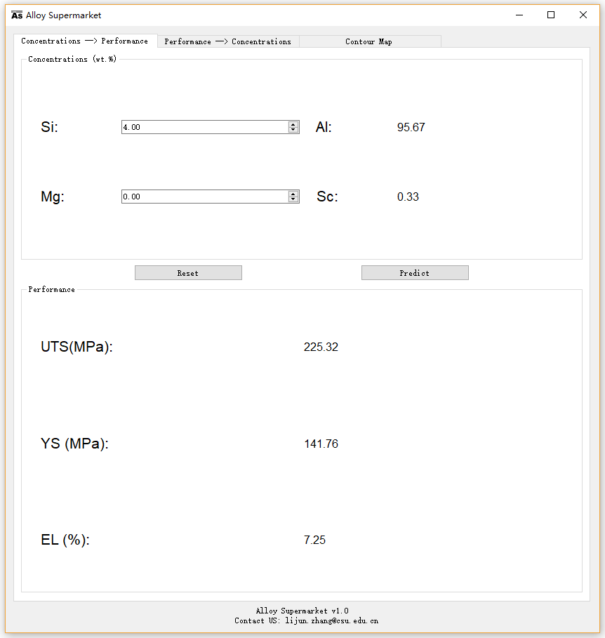
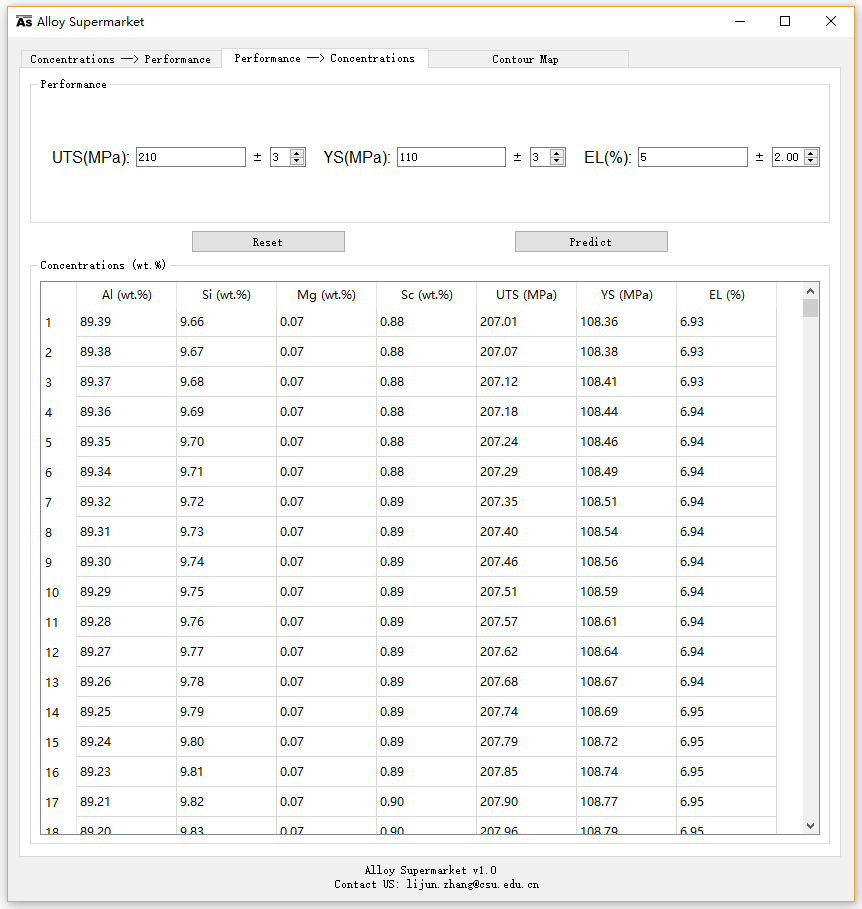

# Alloy Supermarket
One novel alloy design approach integrating computational thermodynamics (CT) and machine learning (ML) has been applied to the Sc-modified Al-Si-Mg alloys. The concept of “alloy supermarket” was proposed to eliminate the gap between the research and engineering areas.

## Get started
### Download
Visit https://github.com/Aguang5241/Alloy_Supermarket/tree/main/res/dnowload to download the software zip (for Windows) or database file. 

### Description
1. On the Concentrations -> Performance page, the users can input the Si and Mg elemental compositions. After clicking the Predict button, one can get the corresponding mechanical properties (UTS, YS, and EL) of the target alloy(s). 

2. On the Performance -> Concentrations page, the users can get a list of possible alloy compositions after inputting the desired mechanical properties values. 

3. The Reset button will reset all the values to default.
